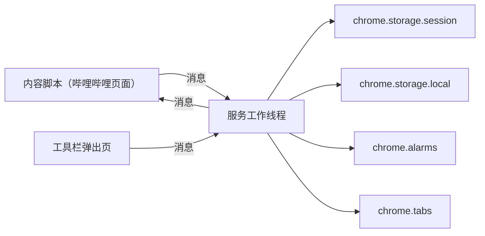

# 系统设计说明书

| 项 | 内容 |
| --- | --- |
| 文档状态 | 已确认 |
| 版本 | 0.2 |
| 日期 | 2026-10-03 |
| 依据 | [需求说明书](<../Requirements Specification/Requirements Specification.md>) 0.2、[background-完善.md](../background.md/background-完善.md) 第 6 节 |

本文说明扩展如何拆开、数据放在哪里、计时在哪里走、界面如何进到哔哩哔哩页面，以及以后加一个网站要改哪里。需求已经确定的行为不再重开讨论。D-1、D-2、D-3 已确认，并写入正文。第 10 节只保留确认记录。

| 版本 | 日期 | 说明 |
| --- | --- | --- |
| 0.1 | 2026-10-02 | 初稿，D-1 至 D-3 待确认。 |
| 0.2 | 2026-10-03 | 确认 D-1 甲、D-2 甲、D-3 乙。 |

## 1. 运行形态

采用在 Chrome 中以开发者模式加载的扩展，清单版本为 Manifest V3。不打包，不上架。安装时加载仓库里的 `extension/` 目录；改完代码后在 `chrome://extensions` 重新加载。

不使用篡改猴脚本、书签脚本或本地代理。理由已在背景第 6 节写明：要同时满足「休眠仍按实际时间计时、退出浏览器或关掉全部哔哩哔哩标签页后计时清零」和「按钮关掉当前标签页，包括窗口里的最后一个标签页」。

扩展不修改哔哩哔哩的网络响应，不加广告拦截规则，也不把目的、备注、回答或设置发到网络。

## 2. 总体结构

服务工作线程是唯一会改存储、唯一会设定闹钟的地方。页面上的内容脚本和工具栏弹出页都通过消息告诉它发生了什么，再按它的回复画界面。



| 组件 | 职责 |
| --- | --- |
| 服务工作线程 | 判断要不要询问或打断，维护共用计时和暂时关闭，读写存储，设定闹钟，关闭标签页 |
| 内容脚本 | 在页面里画目的询问、时长打断和暂时关闭入口；暂停和恢复播放；把点击发给服务工作线程 |
| 工具栏弹出页 | 复盘记录，编辑和删除目的，管理打断选项，修改两个打断间隔 |
| 站点模块 | 判断网址是不是这个站、是不是主页、是不是主要页面，以及如何暂停该站的播放 |
| `chrome.storage.session` | 这一轮使用和正在走动的计时。浏览器退出或重新加载扩展时由 Chrome 清掉 |
| `chrome.storage.local` | 记录、目的、打断选项、间隔设置、按钮位置、暂时关闭截止时间。重启浏览器后仍在 |
| `chrome.alarms` | 到了打断间隔或暂时关闭截止时间时唤醒服务工作线程。不用页面里的定时器担任共用计时 |

内容脚本不读存储。弹出页也不直接写存储。这样闹钟和数据不会各改各的。

服务工作线程会被 Chrome 回收。每次状态变化都写进存储，唤醒后再读出来。内存里的变量只作当次处理的缓存。

## 3. 目录与清单

不引入打包工具。脚本按经典脚本运行，不使用 `import` / `export`。共享常量挂在 `globalThis.OP` 上。服务工作线程用 `importScripts` 载入共享文件；内容脚本由清单按顺序注入，共享同一个隔离世界；弹出页用普通 `script` 标签按同样顺序载入。

```text
extension/
  manifest.json
  icons/icon128.png
  src/shared/constants.js
  src/shared/theme.css
  src/shared/storage.js
  src/shared/time.js
  src/sites/bilibili.js
  src/sites/index.js
  src/background/service-worker.js
  src/background/runtime.js
  src/content/content-script.js
  src/content/ui.js
  src/popup/popup.html
  src/popup/popup.js
  src/popup/popup.css
```

`manifest.json` 的权限和注入范围：

| 项 | 值 |
| --- | --- |
| `manifest_version` | `3` |
| `name` | 有目的 |
| `permissions` | `storage`、`alarms`、`tabs` |
| `host_permissions` | `https://*.bilibili.com/*`、`https://bilibili.com/*` |
| `background.service_worker` | `src/background/service-worker.js` |
| `action.default_popup` | `src/popup/popup.html` |
| 内容脚本 `matches` | 与 `host_permissions` 相同 |
| 内容脚本 `run_at` | `document_start` |
| 内容脚本 `all_frames` | `false`，只注入顶层页面 |
| `web_accessible_resources` | `src/shared/theme.css`，仅对上述哔哩哔哩网址开放 |

内容脚本的 JS 数组顺序为 `constants.js`、`sites/bilibili.js`、`sites/index.js`、`content/ui.js`、`content/content-script.js`。站点判断在内容脚本里只用于「这是不是主页」这类展示前的快速分支；是否弹窗仍以服务工作线程的回复为准。

清单不包含 `webNavigation`。内容脚本不监听 `popstate`、`hashchange` 或站内换址。目的询问只在整页文档加载、内容脚本被注入时判断，见第 6.2 节。

## 4. 数据

### 4.1 本地数据

键名 `localState`，放在 `chrome.storage.local`。

| 字段 | 含义 |
| --- | --- |
| `schemaVersion` | 数字。第一版为 `1`。以后改字段时在服务工作线程里迁移 |
| `purposes` | 目的数组。每项有 `id`、`name`、`order` |
| `interruptOptions` | 打断选项数组。每项有 `id`、`name`、`order`、`locked`、`closesTab` |
| `settings.firstIntervalMinutes` | 首次打断间隔，初始 `5` |
| `settings.againIntervalMinutes` | 再次打断间隔，初始 `5` |
| `snooze.until` | 暂时关闭的截止时间，毫秒时间戳。未启用时为 `null` |
| `snoozeButton.xRatio` / `yRatio` | 按钮在视口中的相对位置，`0` 到 `1`。尚未拖动时为 `null`，界面用右下角默认位置 |
| `records` | 只追加的记录数组 |
| `purposeSnapshots` | 对象。目的被删除时，把当时的名称记在 `purposeSnapshots[id]` |

新安装、本地还没有 `localState` 时写入初始值。重新加载扩展不会重新播种，以免覆盖已经改过的列表。

初始目的 id 固定为 `purpose-seed-1` 至 `purpose-seed-7`，名称顺序对应：学习、游戏攻略、追番、健身、生活经验、关注更新、其他。记录保存 id。目的还在时，展示层读当前名称，所以改名后旧记录显示新名称。

初始打断选项：

| id | 名称 | locked | closesTab |
| --- | --- | --- | --- |
| `interrupt-other` | 其他 | true | false |
| `interrupt-close-tab` | 关闭当前标签页 | true | true |

`locked` 为 true 的项不提供改名和删除。使用者后来添加的项 `locked` 为 false，`closesTab` 为 false。

记录：

| 字段 | 含义 |
| --- | --- |
| `id` | `crypto.randomUUID()` |
| `at` | `Date.now()`，写入时刻 |
| `source` | `purpose` 或 `interrupt` |
| `kind` | `purpose`、`skip`、`option`、`close-tab` |
| `purposeId` | `kind` 为 `purpose` 时的目的 id，否则为 `null` |
| `optionId` | `kind` 为 `option` 时的打断选项 id，否则为 `null` |
| `optionName` | 写入当时的打断选项名称。之后改自定义选项的名字，不改旧记录 |
| `note` | 字符串。没写备注时为空字符串 |

弹出页展示记录时：

- `kind` 为 `purpose`：目的还在列表里就显示当前名称，否则显示 `purposeSnapshots` 里的名称。
- `kind` 为 `skip`：显示「跳过」。
- `kind` 为 `option`：显示 `optionName`。
- `kind` 为 `close-tab`：显示「关闭当前标签页」。
- `note` 为空则不显示备注行。
- 按 `at` 从新到旧排列。同一毫秒按数组里后写入的在前。
- 时间用本机时区显示到秒，满足「至少到分钟，并能分辨先后」。

删除目的时，先把该 id 的当前名称写入 `purposeSnapshots`，再从 `purposes` 去掉。不改记录里的备注，也不删记录。

`chrome.storage.local` 的默认配额约为 10 MB。个人使用的记录量远小于此。写入失败时不关闭询问或打断窗口，界面提示「没能保存，请再试一次」，「关闭当前标签页」也不执行。

### 4.2 会话数据

键名 `sessionState`，放在 `chrome.storage.session`。它在浏览器进程还在时保留，服务工作线程被回收后也还在；退出浏览器或重新加载扩展时消失。因此进行中的计时会清零，而第 4.1 节的数据还在。这满足需求 C-2。

| 字段 | 含义 |
| --- | --- |
| `roundActive` | 当前是否处于一轮使用。最后一个哔哩哔哩标签页关掉后变为 false |
| `timer.mode` | `idle` 或 `running` |
| `timer.startedAt` | 这一段计时开始走动的毫秒时间戳。`idle` 时为 `null` |
| `timer.intervalKind` | `first` 或 `again`。`idle` 时为 `null` |
| `purposePending` | 对象，键为标签页 id。值为 true 表示该页的目的询问还没完成 |
| `purposeAnswered` | 这一轮里是否已经有过确认或跳过 |
| `latestPurposeRecordId` | 这一轮最近一条目的询问记录的 id。没有时为 `null` |
| `interrupt.active` | 是否有一轮尚未完成的时长打断 |
| `interrupt.reason` | `timer` 或 `snooze` |
| `interrupt.pending` | 对象，键为仍须回答的标签页 id |

重新加载扩展后会话被清掉。已经打开的页面会在内容脚本再次注入时按新的一轮处理，因此会再次弹出目的询问。截止时间和记录仍按本地数据保留。

### 4.3 名称与分钟数

目的名称和自定义打断选项名称去掉首尾空白后保存。空字符串不保存，并在输入处提示。长度上限 200 个字符。允许重名，因为记录认的是 id。

两个间隔和暂时关闭的自定义分钟数只接受大于或等于 1 的整数，不设上限。不合法时不写入，提示「请输入大于或等于 1 的整数」。暂时关闭面板里的自定义框每次打开都显示 10，不记住上一次输入。预设 10 分钟和 30 分钟写在常量里，不放进可编辑设置。

## 5. 计时

共用计时只存在于服务工作线程。页面在后台时，页面里的 `setTimeout` 会被 Chrome 拉长，所以不用它担任共用计时。时间戳一律用 `Date.now()`。电脑休眠期间墙钟会往前跳，闹钟在唤醒后补响，休眠时间就算进计时。不用 `performance.now()`，它不按休眠后的墙钟计算。

### 5.1 状态

| 状态 | 计时 | 进入条件 | 离开条件 |
| --- | --- | --- | --- |
| 没有哔哩哔哩标签页 | 清零，`roundActive` 为 false | 最后一个哔哩哔哩标签页关闭，或浏览器退出 | 再打开哔哩哔哩页面 |
| 目的询问未完成 | 不走动 | 某标签页被要求显示目的询问 | 所有目的询问都已确认、跳过，或带着未完成询问的标签页已被关掉 |
| 计时走动 | 按 `startedAt` 和当前间隔走向到期 | 见第 5.2 节 | 到期、暂时关闭开始，或又弹出目的询问 |
| 打断进行中 | 不走动 | 间隔到期，或暂时关闭到期且当时还有哔哩哔哩标签页 | 所有待回答标签页都已完成，或已经没有哔哩哔哩标签页 |
| 暂时关闭 | 清零并保持不动 | 使用者设定或延长截止时间 | 截止时间到达 |

暂时关闭的截止时间本身仍按墙钟走，休眠也算。这段时间里不动的是共用计时，不是截止时间。

### 5.2 何时从零开始

到期时刻是 `startedAt + 间隔分钟 × 60 × 1000`。服务工作线程用名为 `timer-due` 的闹钟设在该时刻。进入不走动的状态时清除这个闹钟。

| 事件 | 计时 |
| --- | --- |
| 目的询问被确认或跳过，并且没有任何页面还挂着目的询问，也没有待显示的时长打断 | 从现在起用首次打断间隔 |
| 目的询问被确认或跳过，但该页还要接着显示时长打断 | 不启动计时，先把打断显示出来 |
| 一轮打断里每个待回答页面都已结束，并且仍有哔哩哔哩标签页 | 从现在起用再次打断间隔 |
| 开始暂时关闭 | 清除 `startedAt`，清除 `timer-due` |
| 暂时关闭到期且当时还有哔哩哔哩标签页 | 立即开始一轮打断，不等间隔 |
| 暂时关闭到期时已经没有哔哩哔哩标签页 | 把 `snooze.until` 清成 `null`，不补弹 |
| 退出浏览器、重新加载扩展、或关掉全部哔哩哔哩标签页 | 会话消失或被清掉，下次从新的一轮开始 |

目的询问的窗口开着时不计时：一旦某个标签页进入 `purposePending`，若计时正在走，就丢掉这一段 `startedAt` 并清除闹钟。询问期间流过的时间不会在确认后被补上。确认后按上表从零开始。

多个主页同时挂着目的询问时，要等这些询问都结束。每一次确认或跳过都写各自的记录；最后一次使 `purposePending` 变空时，才启动首次打断间隔。未确认也未跳过就用浏览器关掉该标签页，不写记录。若这一轮还没有任何确认或跳过，计时不开始。

打断进行中不启动下一次间隔，关掉窗口后的 5 秒空档也不启动。

修改间隔时，若计时正在走动，且改的是 `timer.intervalKind` 对应的那一种，就保留原来的 `startedAt`，用新的分钟数重算到期时刻并改写 `timer-due`。若 `startedAt + 新分钟数` 已经不晚于现在，立即进入一轮打断，并清除 `timer-due`。另一种间隔只写入设置，等它下一次从零开始时再生效。计时没在走时，两个数字都只更新设置。

### 5.3 暂时关闭闹钟

名为 `snooze-end` 的闹钟设在 `snooze.until`。延长时用新的截止时间覆盖旧闹钟。

浏览器启动时会话是空的。服务工作线程读取本地的 `snooze.until`：

- 仍在将来：保持暂时关闭，重新设上 `snooze-end`。计时保持不动。
- 已经过去：把 `until` 清成 `null`，不补弹。浏览器当时没开着，视为到期时没有可打断的标签页。

闹钟允许有短暂延迟，但延迟应明显短于使用者设置的分钟数。机器从休眠唤醒后，已经到期的闹钟应当随即响。

### 5.4 一轮打断

间隔到期或暂时关闭到期时，若有哔哩哔哩标签页：

1. 计时改为不走动。
2. `interrupt.active` 设为 true，`pending` 放上当前每一个哔哩哔哩标签页的 id。
3. 向这些标签页发送显示时长打断的消息。
4. 在这一轮结束前，新打开的哔哩哔哩标签页也加入 `pending`，并显示打断。

某个标签页确认选项后，只写这一条记录，并把它移出 `pending`。其他标签页的窗口保持。

`pending` 变空且仍有哔哩哔哩标签页时，按第 5.2 节启动再次打断间隔。已经没有哔哩哔哩标签页时，清除会话里的一轮使用和计时，不启动间隔。

用浏览器自己的关闭控件关掉标签页时，不写「关闭当前标签页」记录，只把该页移出 `pending` 和 `purposePending`。

## 6. 页面上的界面

### 6.1 注入

内容脚本在 `document_start` 运行。文档还没有 `documentElement` 时，等到能挂上节点再挂。非 HTML 文档不挂界面。

界面挂在 `document.documentElement` 末尾的宿主节点上，使用 Shadow DOM，避免和哔哩哔哩的样式互相污染。宿主的 `z-index` 取 `2147483646`。每次显示询问或打断时把宿主挪到末尾，减少被页面后来插入的节点盖住的可能。

样式来自扩展内的 `theme.css`，由 Shadow DOM 里的链接载入。颜色：

| 用途 | 值 |
| --- | --- |
| 背景 | `#16171d` |
| 表面 | `#23242c` |
| 文字 | `#f3f4f6` |
| 次要文字 | `#b6b8c3` |
| 分隔 | `#3a3b46` |
| 强调 | `#7c8cff` |

弹出页链接同一份 `theme.css`。本版没有浅色变量。

询问和打断使用铺满视口的遮罩，遮罩接收点击，页面在遮罩下面不能操作。暂时关闭按钮的点击区域独立于遮罩；询问或打断出现时，窗口盖在按钮上面。

页面处于全屏时，先退出全屏，再显示目的询问或时长打断，否则全屏视频会盖住扩展的窗口。

### 6.2 目的询问

遮罩中的窗口标题为「本次使用的目的是什么」。下面按 `order` 列出目的。列表下方有一个添加框：输入名称，确认后把新目的发给服务工作线程；成功后刷新列表并可以立刻选中它。窗口不提供编辑、删除，也没有「跳过」以外的关闭方式。

选中一个目的后，在该项下方出现一个备注框和「确认」。没点确认不写记录。备注可以空着。「跳过」单独放在窗口底部，点击后立即写记录并关闭窗口，不出现备注框。

服务工作线程同意显示时，内容脚本才显示。同意的条件：

| 情况 | 是否显示 |
| --- | --- |
| 主页发生一次新的文档加载（刷新或新标签页） | 显示 |
| 非主页加载时，`roundActive` 还是 false | 显示，并把它设为 true。这是一轮使用的开始 |
| 非主页加载时，该标签页仍在 `purposePending` | 显示 |
| 非主页加载时，这一轮已经开始，且该页不在 `purposePending` | 不显示 |
| 站内软导航：地址变了，但文档没有重新加载 | 不重新判断。已经打开的目的询问、时长打断和暂时关闭按钮留在当前文档上 |

`content-ready` 只在内容脚本注入时发送一次。软导航不发送这条消息，也不新开目的询问。

同一标签页上目的询问和时长打断都要出现时，内容脚本只画目的询问。目的询问关闭后，若该页仍在 `interrupt.pending` 里，再画时长打断。

### 6.3 时长打断

窗口标题为「现在在做什么」。若 `latestPurposeRecordId` 能解析到一条目的记录，在选项上方显示「这次的目的」、解析后的名称，以及非空备注。解析规则与弹出页相同。没有记录则不显示这块。

选项来自 `interruptOptions`。选中 `closesTab` 为 false 的项后出现一个备注框和「确认」。备注可以空着。确认后只关闭本页窗口。

「关闭当前标签页」不出现备注框。内容脚本发出消息后等待成功回复，成功才由服务工作线程调用 `chrome.tabs.remove`。写入失败则标签页保持打开，窗口留着并提示保存失败。

窗口右上角有一个关闭控件，文案用「关掉」。它不是「关闭当前标签页」。点击后不写记录，遮罩去掉。若关闭前这个页面里的视频是播放着的，并且是被这次窗口暂停的，则恢复播放。内容脚本用 `window.setTimeout` 在 5 秒后再次显示窗口并再次暂停。这 5 秒不用 `chrome.alarms`：闹钟的最短延迟长于 5 秒，而这段等待只发生在使用者刚刚操作过的那个页面上，页面定时器足够用。

这 5 秒内若发生整页加载，新的内容脚本会看到打断仍未完成，立即显示窗口，不再等完剩余时间。

### 6.4 暂停播放

站点模块提供 `pausePlayback(document)`。哔哩哔哩的实现收集顶层文档里正在播放的 `video`，调用 `pause()`，并返回只恢复这些元素的函数。恢复时若 `play()` 被浏览器拒绝，忽略该错误。

播放器若在以后改成不听 `video.pause()`，只改 `src/sites/bilibili.js` 里的这个函数。

### 6.5 暂时关闭入口

每个匹配的哔哩哔哩顶层页面都挂同一个按钮。第一版不把入口限制在主要页面。若某一类页面确实无法挂载，把站点模块的入口策略改为 `primary`，并在该文件顶部列出未覆盖的网址；主要页面仍必须挂载。主要页面的判断：

| 页面 | 条件 |
| --- | --- |
| 主页 | https，主机名为 `bilibili.com` 或 `www.bilibili.com`，路径为 `/` |
| 视频播放页 | 主机名 `www.bilibili.com`，路径以 `/video/` 开头 |
| 番剧播放页 | 主机名 `www.bilibili.com`，路径以 `/bangumi/` 开头 |
| 搜索页 | 主机名 `search.bilibili.com` |
| 推荐页 | 主机名 `www.bilibili.com`，路径包含 `/v/popular` |

按钮半透明：背景 `rgba(22, 23, 29, 0.72)`，文字用浅色。未暂时关闭时文案为「暂停」。生效时文案为「至 HH:mm」，用截止时间的本机时分。拖动时不展开面板。指针移动超过 4 像素视为拖动，松手时把位置换算成相对视口的 `xRatio`、`yRatio` 发给服务工作线程。没有超过 4 像素的松手视为点击，展开或收起面板。

尚未保存位置时，按钮距视口右缘和下缘各 24 像素。已保存的比例在每个页面加载时换算成像素，并限制在视口内，留出 8 像素边距。窗口尺寸变化时按比例重新摆放。

面板使用深色表面，包含「10 分钟」「30 分钟」和自定义输入。点击预设立即生效。自定义需填写合法分钟数后确认。若当时已经在暂时关闭中，新的截止时间是现在加上所选分钟数，原来的剩余时间不保留。面板在生效期间同时显示完整的截止时间。

## 7. 弹出页

弹出页宽 360 像素，高不超过 560 像素，内部滚动。从上到下四块：

1. **间隔。** 「首次打断间隔（分钟）」和「再次打断间隔（分钟）」。输入框失焦或按下 Enter 时提交。不合法则保持原值并显示提示。
2. **目的。** 列出全部目的，每行可以改名或删除。没有添加框。删除前用浏览器的确认框问一次。改名、删除成功后，服务工作线程通知已打开的哔哩哔哩标签页刷新正在显示的目的列表。
3. **打断选项。** 顶部有添加框。锁定的两项只显示名称。其余项可以改名和删除，删除前同样确认。
4. **记录。** 新的在前，每条显示时间、来源（「目的询问」或「时长打断」）、选择或回答、非空备注。没有删除控件。

弹出页打开时向服务工作线程要一份本地数据的只读副本。所有修改都走消息。

## 8. 消息

消息都带 `type`。需要写存储的请求使用 `sendMessage` 的回复表示成功或失败。

| type | 方向 | 作用 |
| --- | --- | --- |
| `content-ready` | 内容脚本 → 服务工作线程 | 仅在内容脚本注入时发送一次，带上当前网址。回复该页应显示的目的询问、时长打断、按钮位置、列表和对照用的目的。软导航不发送 |
| `purpose-add` | 内容脚本 → 服务工作线程 | 添加目的。回复新列表 |
| `purpose-commit` | 内容脚本 → 服务工作线程 | 确认目的和备注 |
| `purpose-skip` | 内容脚本 → 服务工作线程 | 跳过 |
| `interrupt-commit` | 内容脚本 → 服务工作线程 | 确认打断选项和备注 |
| `interrupt-dismiss` | 内容脚本 → 服务工作线程 | 关掉打断窗口，不写记录 |
| `interrupt-close-tab` | 内容脚本 → 服务工作线程 | 先写记录，成功后再关掉标签页 |
| `snooze-set` | 内容脚本 → 服务工作线程 | 带分钟数，开始或按现在重新计算暂时关闭 |
| `snooze-move` | 内容脚本 → 服务工作线程 | 保存按钮的相对位置 |
| `popup-get` | 弹出页 → 服务工作线程 | 取列表、设置和记录 |
| `settings-set` | 弹出页 → 服务工作线程 | 修改两个间隔 |
| `purpose-update` / `purpose-delete` | 弹出页 → 服务工作线程 | 改名或删除目的 |
| `option-add` / `option-update` / `option-delete` | 弹出页 → 服务工作线程 | 管理自定义打断选项 |
| `lists-changed` | 服务工作线程 → 内容脚本 | 目的或打断选项变了，刷新已打开的窗口 |
| `show-interrupt` | 服务工作线程 → 内容脚本 | 该页需要显示时长打断。若目的询问还在，内容脚本先记着，等目的询问结束再显示 |

服务工作线程用 `sender.tab.id` 识别标签页，不信任消息体里自填的标签页 id。

## 9. 站点扩展

第一版的目的列表、打断选项、记录和计时是全局一份，不是按网站拆开的。站点模块只回答「这个网址属不属于我」以及「播放怎么暂停」。

`src/sites/bilibili.js` 导出纯函数对象（在经典脚本里则写到 `globalThis.OP.sites`）：

| 函数或字段 | 作用 |
| --- | --- |
| `id` | `bilibili` |
| `matches(url)` | https，且主机名为 `bilibili.com` 或以 `.bilibili.com` 结尾 |
| `isHome(url)` | 第 6.5 节的主页条件 |
| `isPrimary(url)` | 第 6.5 节的主要页面条件 |
| `entry` | 第一版为 `all`。退让时改为 `primary` |
| `pausePlayback(document)` | 第 6.4 节 |

`src/sites/index.js` 提供 `findSite(url)`，返回第一个匹配的站点，否则返回空。服务工作线程只对 `findSite` 有结果的标签页计入一轮使用和打断。

以后增加网站时改这些地方，不改计时状态机和记录结构：

1. 新增 `src/sites/<站点 id>.js`，实现同一组函数。
2. 在 `index.js` 注册它。
3. 把该站的 https 网址加入清单的 `host_permissions`、内容脚本 `matches` 和 `web_accessible_resources`。
4. 若播放器不是顶层 `video`，只改该站的 `pausePlayback`。

目的、打断选项、记录、间隔和计时保持全局一份，存储里不加 `siteId`。真的要接第二个网站、并且需要各站分开数据时，再改存储形状。第一版不实现这层拆分。

初始目的写在第 4.1 节的播种数据里，不写进站点文件。这样计时和记录模块不依赖哔哩哔哩的文案。

## 10. 确认结果

| 编号 | 选择 | 写入 |
| --- | --- | --- |
| D-1 | 甲。只在整页加载时重新判断目的询问。软导航不新开询问，暂时关闭按钮留在原来的文档上 | 第 3 节、第 6.2 节、第 8 节 |
| D-2 | 甲。目的、记录和计时保持全局一份，不加 `siteId`，直到真的要加第二个网站再改存储 | 第 4 节、第 9 节 |
| D-3 | 乙。正在使用的那种间隔按原来的 `startedAt` 和新分钟数重算；已经超过则马上打断。另一种间隔只影响下一次 | 第 5.2 节 |

## 11. 其余实现细节

下面这些需求没有逐项指定，实现按此执行。

| 事项 | 做法 |
| --- | --- |
| 扩展在工具栏上的名字 | 有目的 |
| 界面隔离 | Shadow DOM |
| 按钮位置 | 相对视口的比例，而不是固定像素，避免换页后跑出屏幕 |
| 未拖动时的位置 | 距右缘和下缘各 24 像素 |
| 未生效时的按钮文案 | 暂停 |
| 生效时的按钮文案 | 至 HH:mm |
| 拖动和点击的区分 | 移动超过 4 像素算拖动 |
| 关掉打断窗口后的 5 秒 | 放在该页内容脚本的 `setTimeout` |
| 打断选项写进记录后的名称 | 写入时复制一份，之后改名不回溯 |
| 全屏 | 显示询问或打断前先退出全屏 |
| 删除目的或自定义打断选项 | 弹出页里先用确认框确认 |
| 两个脚本之间的依赖 | 不用打包器，不用 ES Module |
| 播种时机 | 仅当本地还没有 `localState` |

## 12. 与开发步骤的对应

实现仍按需求说明书第 7 节分四步。数据形状和站点函数从第一步就按本文建立，避免做完询问后再改存储。

| 步骤 | 本步做出的部分 | 可以先不接上的行为 |
| --- | --- | --- |
| 1 | 清单、本地数据、弹出页的记录和目的编辑删除、内容脚本的目的询问、添加目的 | 闹钟、时长打断、暂时关闭按钮 |
| 2 | 会话计时、`timer-due`、每个标签页上的打断、暂停播放、关闭标签页 | 暂时关闭 |
| 3 | `snooze-end`、可拖动按钮和面板 | 第二个网站 |
| 4 | 核对 `findSite` 是否已被前三步使用。若前三步已经只通过站点模块认网址，这一步只补注释和入口退让开关，不改状态机 | 无新的使用者可见功能 |

第 1 步可以先在主页上把询问和记录走通，结束前仍要覆盖非主页在新一轮使用开始时的询问。

## 13. 与需求的对应

| 需求 | 设计位置 |
| --- | --- |
| FR-1 目的询问 | 第 6.2 节、第 5.2 节 |
| FR-2 时长打断与两个间隔 | 第 5 节、第 6.3 节、第 6.4 节 |
| FR-3 暂时关闭 | 第 5.3 节、第 6.5 节 |
| FR-4 复盘 | 第 4.1 节、第 7 节 |
| FR-5 列表与设置 | 第 4 节、第 7 节 |
| C-1、C-2 加载方式与重新加载后计时清零 | 第 1 节、第 4.2 节 |
| C-4 数据不离开本机 | 第 1 节 |
| C-5 站点配置与流程分开 | 第 9 节 |
| C-6 深色主题 | 第 6.1 节 |
| 背景里的 `chrome.storage.session`、`chrome.storage.local`、`chrome.alarms`、`chrome.tabs.remove` | 第 2 节、第 4 节、第 5 节、第 6.3 节 |
| D-1 至 D-3 | 第 10 节 |
